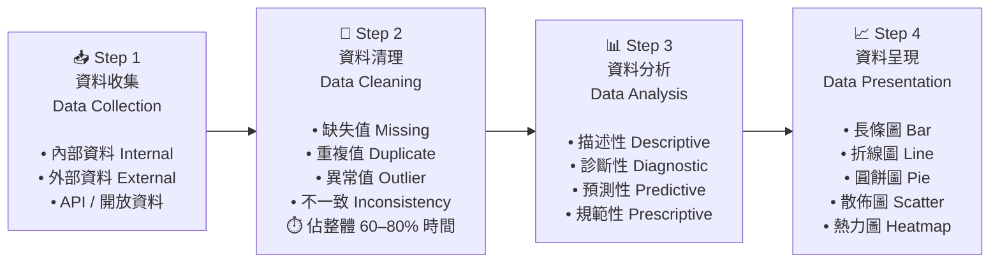

# Diagram 01 — 資料處理流程圖（Data Pipeline Flow）

## Mermaid Flowchart



## ASCII 版（無 mermaid 環境時使用）

```
┌───────────────────────────────────────────────────────────────────────────────┐
│                     資料處理四步驟流程（Data Pipeline）                          │
└───────────────────────────────────────────────────────────────────────────────┘

  ┌──────────────┐       ┌──────────────┐       ┌──────────────┐       ┌──────────────┐
  │ 📥 Step 1    │  →→→  │ 🧹 Step 2    │  →→→  │ 📊 Step 3    │  →→→  │ 📈 Step 4    │
  │              │       │              │       │              │       │              │
  │ 資料收集      │       │ 資料清理      │       │ 資料分析      │       │ 資料呈現      │
  │ Data         │       │ Data         │       │ Data         │       │ Data         │
  │ Collection   │       │ Cleaning     │       │ Analysis     │       │ Presentation │
  │              │       │              │       │              │       │              │
  │ • 內部資料    │       │ • 缺失值      │       │ • 描述性      │       │ • 長條圖      │
  │ • 外部資料    │       │ • 重複值      │       │ • 診斷性      │       │ • 折線圖      │
  │ • API        │       │ • 異常值      │       │ • 預測性      │       │ • 圓餅圖      │
  │              │       │ • 不一致      │       │ • 規範性      │       │ • 散佈圖      │
  │              │       │              │       │              │       │ • 熱力圖      │
  │   買食材      │       │  洗切備料     │       │  烹調料理     │       │  擺盤上桌     │
  └──────────────┘       └──────────────┘       └──────────────┘       └──────────────┘
       ↑                       ↑
   先釐清目標              🔥 最花時間
   來源多元化             (60–80% 工時)

🔑 口訣：收（收集）→ 清（清理）→ 分（分析）→ 呈（呈現）
⚠️ 陷阱：順序固定不可跳，清理一定在分析之前！
```

## 使用說明

- 置於 study-guide.md Section 3 · 3-1 全景圖的 ASCII 圖之後，作為視覺補充
- 考試重點：能背出四步驟順序，能解釋每步的目的
