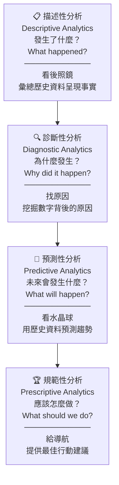

# Diagram 02 — 資料分析四大類型金字塔

## Mermaid 版



## ASCII 金字塔版

```
                         分析深度 / 決策能力
                        ←───────────────────→

                              ┌──────┐
                              │ 🏆   │   規範性分析
                              │ ⭐⭐⭐⭐│   Prescriptive Analytics
                             /│      │\  ─────────────────────────
                            / │      │ \ 應該怎麼做？What should?
                           /  └──────┘  \  → 給導航 → 提供行動建議
                          /  ┌────────┐  \
                         /   │ 🔮  ⭐⭐⭐│   \  預測性分析
                        /    │         │    \ Predictive Analytics
                       /     │         │     \────────────────────
                      /      └────────┘      \ 未來會發生什麼？
                     /    ┌──────────────┐    \ → 看水晶球 → 預測趨勢
                    /     │ 🔍      ⭐⭐   │     \
                   /      │              │      \ 診斷性分析
                  /       │              │       \ Diagnostic Analytics
                 /        └──────────────┘        \────────────────
                /    ┌──────────────────────────┐   \ 為什麼發生？
               /     │ 📋                  ⭐    │    \ → 找原因 → 挖掘根本原因
              /      │                          │     \
             /       │ 描述性分析                │      \
            /        │ Descriptive Analytics     │       \
           /_________│__________________________│________\
                     │ 發生了什麼？What happened?│
                     │ → 看後照鏡 → 彙總歷史事實 │
                     └──────────────────────────┘

          基礎（容易）                              進階（複雜）
          ↓ 過去                                    ↑ 未來
```

## 四大類型速查表

| 層次 | 中文 | English | 核心問題 | 白話比喻 | 難度 |
|-----|------|---------|---------|---------|------|
| 1 | 描述性分析 | Descriptive | 發生了什麼？ | 看後照鏡 | ⭐ |
| 2 | 診斷性分析 | Diagnostic | 為什麼發生？ | 找原因 | ⭐⭐ |
| 3 | 預測性分析 | Predictive | 未來會怎樣？ | 看水晶球 | ⭐⭐⭐ |
| 4 | 規範性分析 | Prescriptive | 該怎麼做？ | 給導航 | ⭐⭐⭐⭐ |

## 情境對應口訣

- 看到「統計/彙總/報表」→ 描述性
- 看到「為什麼/原因/歸因」→ 診斷性
- 看到「預測/推估/未來」→ 預測性
- 看到「建議/最佳/應該做」→ 規範性

⚠️ 陷阱：四種類型呈遞進關係，不能跳著做。先描述→再診斷→再預測→最後規範。
