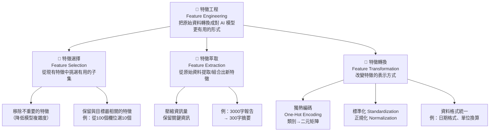

# Diagram 03 — 特徵工程分類樹（Feature Engineering Taxonomy）

## Mermaid 分類樹



## ASCII 分類樹

```
🔧 特徵工程（Feature Engineering）
│  定義：把原始資料轉換成對 AI（Artificial Intelligence，人工智慧）
│        模型更有用的形式，提升 ML（Machine Learning，機器學習）效能
│
├── 🎯 特徵選擇（Feature Selection）🔥
│   │  目的：挑出有用的，丟掉無關的
│   │  做法：從現有特徵中選出最重要的子集
│   │  結果：特徵數量【減少】（保留原始特徵）
│   │
│   ├── 移除不重要的特徵（如星座、血型）
│   ├── 移除高度相關的重複特徵
│   └── 白話：104 履歷只填工程師需要的欄位
│
├── 🧬 特徵萃取（Feature Extraction）🔥
│   │  目的：壓縮出精華，創造新特徵
│   │  做法：從原始資料組合/壓縮出新的特徵表示
│   │  結果：特徵形式【改變】（原始特徵被轉換）
│   │
│   ├── 將 100 個指標壓縮成 5 個核心因子
│   └── 白話：3000 字報告 → 300 字摘要（重點都在）
│   （此為中級內容，初級只需了解概念）
│
└── 🔄 特徵轉換（Feature Transformation）🔥🔥
    │  目的：換個表達方式，讓模型看得懂
    │  做法：改變特徵的表示方式
    │  結果：特徵值【改變格式/尺度】
    │
    ├── 🔥🔥 獨熱編碼（One-Hot Encoding）— 必考！
    │   ├── 無順序類別型資料 → 二元（0/1）矩陣
    │   ├── 適用：顏色（紅/藍/綠）、城市名
    │   └── 不適用：有順序的類別（教育程度、等級）
    │
    ├── 標準化（Standardization）
    │   └── 讓資料以平均值為中心，統一量尺
    │
    └── 正規化（Normalization）
        └── 縮放到固定範圍（通常 0-1）
```

## 三大類型比較表

| 比較項目 | 特徵選擇 | 特徵萃取 | 特徵轉換 |
|---------|---------|---------|---------|
| 英文 | Feature Selection | Feature Extraction | Feature Transformation |
| 做法 | 從現有特徵中挑選 | 從原始資料創造新特徵 | 改變特徵表示方式 |
| 原始特徵 | 保留原樣（只是挑選） | 被壓縮/組合成新形式 | 被轉換格式/尺度 |
| 數量變化 | 減少 | 可能減少 | 通常不變 |
| 代表操作 | 移除「血型」欄位 | 降維、主題提取 | 獨熱編碼、標準化 |
| 白話比喻 | 只填重點履歷欄位 | 報告濃縮成摘要 | 把文字評分轉成數字 |

⚠️ 陷阱：三者都屬於特徵工程，不是三個獨立的流程步驟。
⚠️ 陷阱：特徵工程初級只考概念，不考程式碼或演算法細節。
