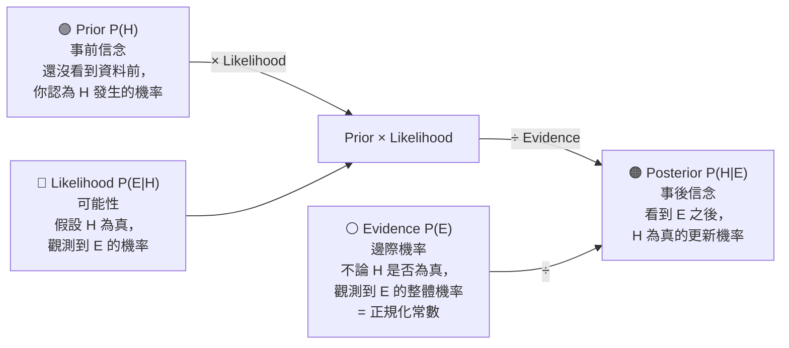

# Bayes 更新流程 — Bayesian Update Flow

> 貝氏定理的四個角色：不要背公式，先記住每個角色是誰



## 公式對照

```
P(H|E) = P(E|H) × P(H) / P(E)
           ↑          ↑       ↑
       Likelihood  Prior  Evidence
```

## 四個角色記憶口訣

| 角色 | 中文 | 問自己 |
|---|---|---|
| Prior P(H) | 事前機率 | 沒看資料前，我相信 H 多少？ |
| Likelihood P(E\|H) | 可能性 | 如果 H 是真的，我會看到 E 的機率多大？ |
| Evidence P(E) | 邊際機率 | 不管 H 真假，看到 E 的機率多大？ |
| Posterior P(H\|E) | 事後機率 | 看到 E 之後，H 為真的機率更新為多少？ |

> 🔑 考試看到「更新機率」→ Posterior；看到「假設 H 為真下觀測 E」→ Likelihood
