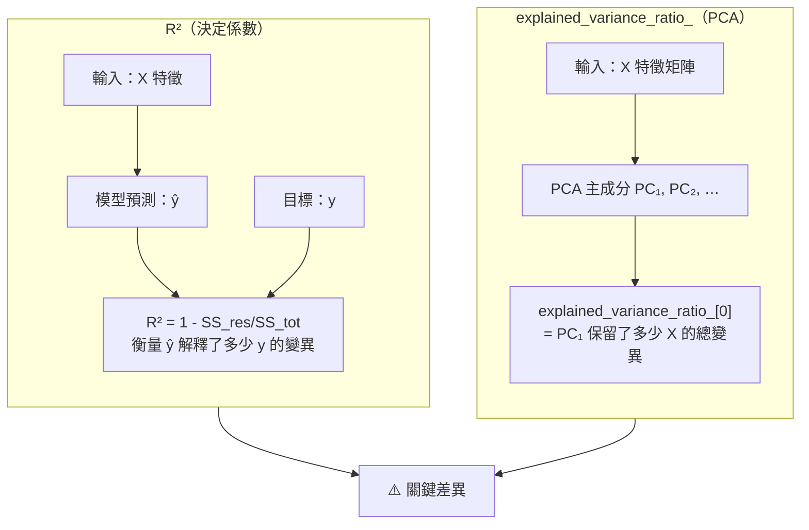

# R² vs PCA 變異解釋對照 — Two Ways to Explain Variance

> 兩個「解釋變異」的指標，方向完全不同，考試最容易混淆



## 對照表

| 比較點 | R² | explained_variance_ratio_ |
|---|---|---|
| 衡量對象 | 模型預測 ŷ 對目標 y 的解釋力 | 主成分對特徵矩陣 X 的保留比例 |
| 應用場景 | 迴歸模型評估 | PCA 降維後選擇保留幾個主成分 |
| 值的範圍 | ≤1（可為負，模型比基準線差） | 0–1（各成分比例，加總=1） |
| sklearn 位置 | `model.score(X, y)` | `pca.explained_variance_ratio_` |
| 回答問題 | 「我的模型解釋了幾% 的 y 變異？」 | 「前 k 個主成分保留了幾% 的資訊？」 |

## 考試情境快判

```
情境：「模型 R² = 0.85，代表…」
→ 模型解釋了 y 85% 的變異（迴歸評估）

情境：「PCA 後 explained_variance_ratio_ = [0.72, 0.18, 0.06, …]」
→ 前 2 個主成分保留了 72+18 = 90% 的 X 特徵資訊
```

> 🔑 R² → 看 y 被解釋多少；explained_variance_ratio_ → 看 X 被壓縮後保留多少
