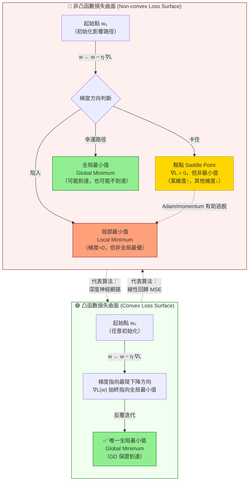

# 損失曲面與梯度下降路徑 (Loss Surface & Gradient Descent Path)

## 凸函數 vs 非凸函數損失曲面



## SGD 更新路徑示意（ASCII 輔助）

```
損失 L(w)
  │
  │    ╭──────╮                凸函數：碗形
  │   ╱        ╲               → GD 直線收斂到底部
  │  ╱    🎯    ╲
  │ ╱  Global Min ╲
  └─────────────────── w
  
  │  ╭──╮    ╭──╮             非凸函數：崎嶇地形
  │ ╱    ╲  ╱    ╲            → 可能卡在鞍點或局部最小值
  │╱  鞍點╲╱ 局部Min╲  全局Min
  └──────────────────────── w
       ⚠️        ⚠️      🎯
```

## 考試重點

| 曲面類型 | 特徵 | 代表算法 | GD 保證？ |
|---------|------|---------|---------|
| 凸函數 | 唯一全局最小值，梯度始終指向最優解 | Linear Regression MSE | ✅ 保證收斂 |
| 非凸函數 | 多局部最小值 + 鞍點，∇L=0 不代表最優 | 深度神經網路 | ❌ 不保證 |

> 🔑 考試快判：看到「深度學習」→ 非凸損失曲面；看到「線性回歸 MSE」→ 凸函數，GD 保證收斂
