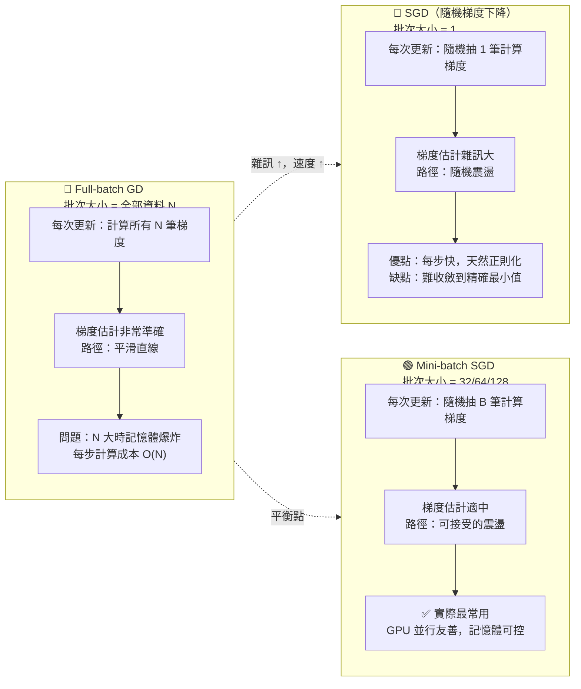

# GD vs SGD vs Mini-batch 收斂比較 (Convergence Comparison)

## 三種批次策略收斂路徑



## 損失曲線震盪程度示意

```
損失 L
  │
  │── ── ── ── ── ──          🔵 Full GD：平滑曲線
  │   ╲
  │    ╲────────────          → 穩定但慢（每步成本高）
  │
  │╭╮ ╭╮╭╮╭╮ ╭╮╭╮╭╮          🔴 SGD (batch=1)：高噪聲
  │╰╯╭╯╰╯╰╯╰─╯╰╯╰╯╰─          → 快但震盪，難精確收斂
  │
  │╭╮╭╮╭─╮╭─╮╭──╮             🟢 Mini-batch (B=64)：中等噪聲
  │╰╯╰╯╰─╯╰─╯╰──╯──           → 實際最佳平衡
  └─────────────────── epoch
```

## 三種策略比較表

| 特徵 | Full GD | SGD (B=1) | Mini-batch (B=32–256) |
|------|---------|-----------|----------------------|
| 批次大小 | 全部 N 筆 | 1 筆 | 32/64/128/256 筆 |
| 梯度估計準確度 | 🟢 最準確 | 🔴 雜訊最大 | 🟡 適中 |
| 每步計算成本 | 🔴 最高 O(N) | 🟢 最低 O(1) | 🟡 中 O(B) |
| 收斂穩定性 | 🟢 最穩定 | 🔴 震盪嚴重 | 🟡 可接受 |
| 記憶體需求 | 🔴 最大 | 🟢 最小 | 🟡 中（可調整） |
| GPU 並行效率 | 🟢 高（但受記憶體限制） | 🔴 幾乎無法並行 | 🟢 最佳 |
| 實際使用頻率 | 罕見（小資料集） | 少見 | ✅ 最常用 |

> 🔑 考試快判：「記憶體不足（OOM）」→ 減小 batch_size；「GPU 利用率低」→ 增大 batch_size（在記憶體限制內）
