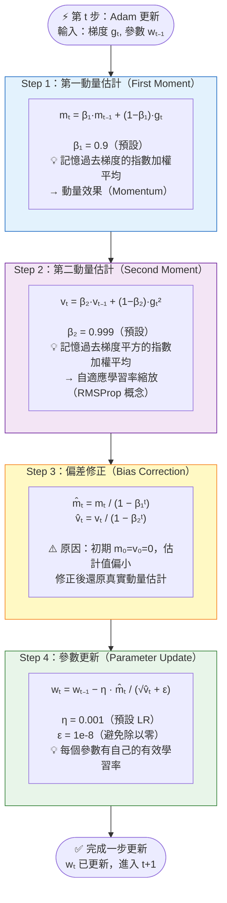

# Adam 更新規則分解 (Adam Optimizer Update Steps)

## Adam 四步驟計算流程



## Adam vs SGD 核心差異

```
SGD 更新：
  w ← w − η · g
      ↑     ↑
   全局LR  原始梯度（所有參數同一個 η）

Adam 更新：
  w ← w − η · m̂ / (√v̂ + ε)
      ↑     ↑    ↑
   全局LR  動量  自適應尺度（每個參數 η 不同）
```

## 超參數一覽

| 超參數 | 預設值 | 角色 | 考試重點 |
|--------|--------|------|---------|
| β₁ | 0.9 | 第一動量衰減率（動量項） | β₁ 控制「動量」，是梯度的指數加權平均 |
| β₂ | 0.999 | 第二動量衰減率（自適應縮放） | β₂ 控制「梯度平方」的加權平均，接近 1 代表長記憶 |
| ε | 1e-8 | 數值穩定常數（避免除以零） | 極小值，考試認識即可，不需記數值 |
| η (lr) | 0.001 | 全局學習率 | Adam 預設 lr 比 SGD 小（SGD 常用 0.01） |

> 🔑 考試快判：β₁ → 動量（第一動量）；β₂ → 自適應縮放（第二動量）；兩個不要搞反！

## 口訣
**「動量、規模、修正、更新」**
1. **動** — m（動量，β₁）
2. **規** — v（規模/方差，β₂）  
3. **修** — 偏差修正（m̂, v̂）
4. **新** — 更新 w
