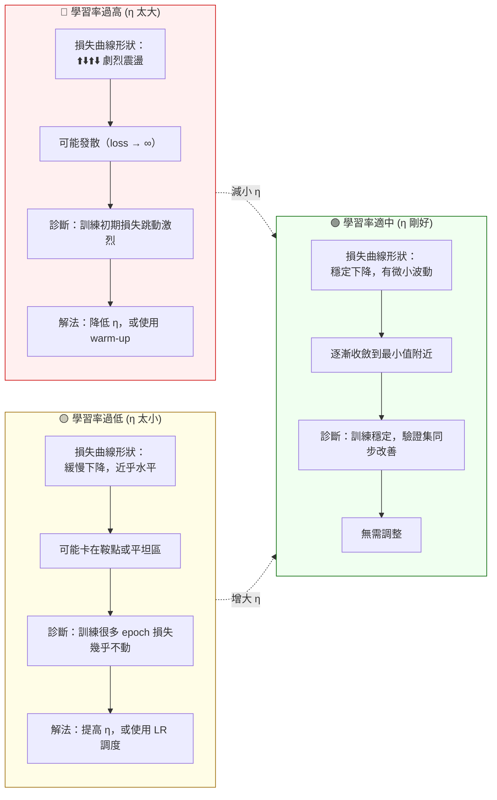
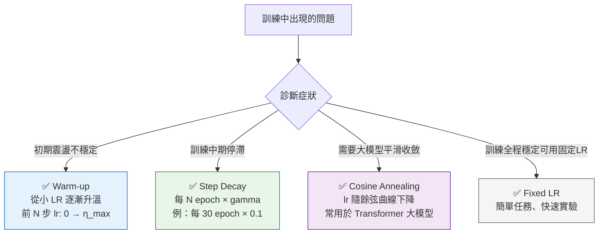

# 學習率診斷圖 (Learning Rate Diagnosis)

## 三種學習率症狀對比



## 損失曲線視覺對比

```
損失 L
  │
  │ 🔴過高：
  │╭╮╭╮╭╮╭╮╭╮╭╮╭╮╭╮╭╮╭╮
  │╰╯╰╯╰╯╰╯╰╯╰╯╰╯╰╯╰╯╰╯  ← 震盪，不收斂
  │
  │ 🟢適中：
  │╭─╮╭──╮╭────╮
  │╰─╯╰──╯╰────╯──────── ← 穩定下降
  │
  │ 🟡過低：
  │╭──────────────────
  │╰────────────────── ← 幾乎不動
  │
  └─────────────────────── epoch
```

## 學習率調度策略



## 診斷速查

| 症狀 | 原因 | 解法 |
|------|------|------|
| 損失震盪激烈、發散 | 學習率過高 | 降低 η；或加 warm-up |
| 損失下降極慢、幾乎不動 | 學習率過低 或 卡在鞍點 | 提高 η；或換 Adam（更好逃離鞍點） |
| 損失突然爆炸（→ NaN） | 學習率過高 或 梯度爆炸 | 降低 η；加 gradient clipping |
| 訓練初期不穩定後期穩定 | 正常現象 或 需要 warm-up | 加 warm-up 調度 |

> 🔑 考試三字訣：**「震是高、慢是低、爆是崩」**
