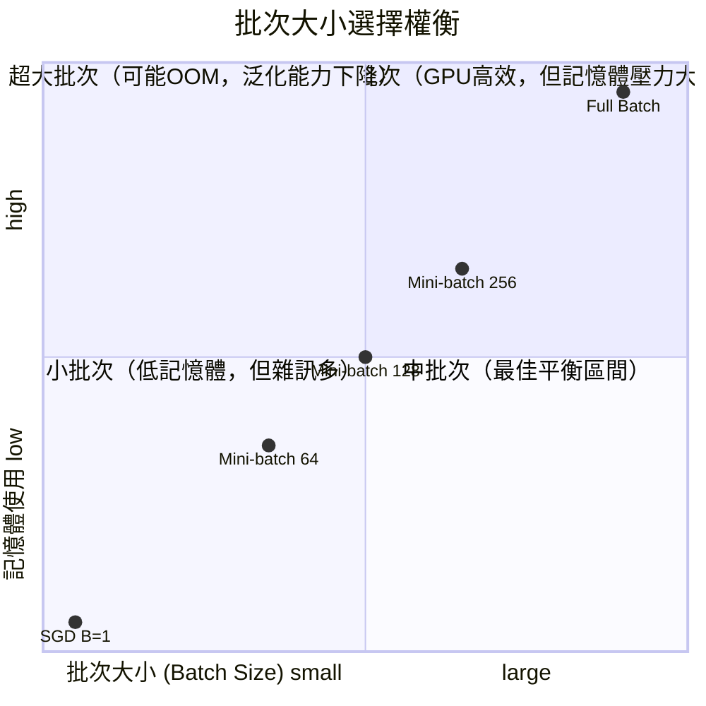
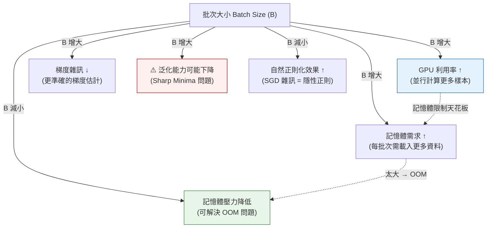
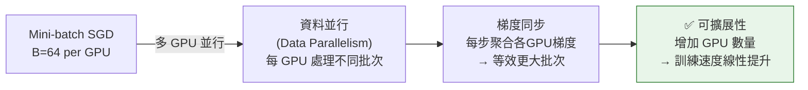

# 批次大小與可擴展性權衡 (Batch Size & Scalability Trade-offs)

## 批次大小對各維度的影響



## 批次大小影響矩陣



## 可擴展性（Scalability）評估維度

```
批次大小選擇 → 影響三個維度：

1. 計算效率（GPU 並行）
   小批次 ←────────────────→ 大批次
   低GPU利用率              高GPU利用率
         ⬆️最佳平衡：B=64~256

2. 記憶體需求
   小批次 ←────────────────→ 大批次
   低記憶體              記憶體爆炸(OOM)
         ⬆️OOM臨界點依 GPU VRAM 而定

3. 泛化能力（訓練出的模型好不好）
   小批次 ←────────────────→ 大批次
   高泛化（Flat Minima）  低泛化（Sharp Minima）
   （雜訊幫助逃離過擬合）  （可能過擬合，但工程上
                           可用 LR Warmup 緩解）
```

## 分散式訓練與可擴展性



## 批次大小速查表

| 批次大小 | 記憶體 | GPU效率 | 梯度雜訊 | 泛化 | 適用場景 |
|---------|--------|---------|---------|------|---------|
| 1（純SGD） | 最低 | 最低 | 最高 | 好 | 極端記憶體限制 |
| 32–64 | 低 | 中 | 中高 | 好 | 一般深度學習 |
| 128–256 | 中 | 高 | 中低 | 中 | ✅ 最常用平衡點 |
| 512+ | 高 | 很高 | 低 | 風險↑ | 大規模訓練（需調LR） |
| 全資料 | 最高 | 很高 | 最低 | 最差 | 小資料集 / 凸問題 |

> 🔑 考試快判：
> - **OOM（記憶體不足）** → 減小 batch_size
> - **GPU 利用率低** → 增大 batch_size（在記憶體限制內）
> - **泛化能力差、過擬合** → 考慮減小 batch_size 或加正則化
> - **分散式訓練** → Mini-batch 是基礎，自然支援資料並行
