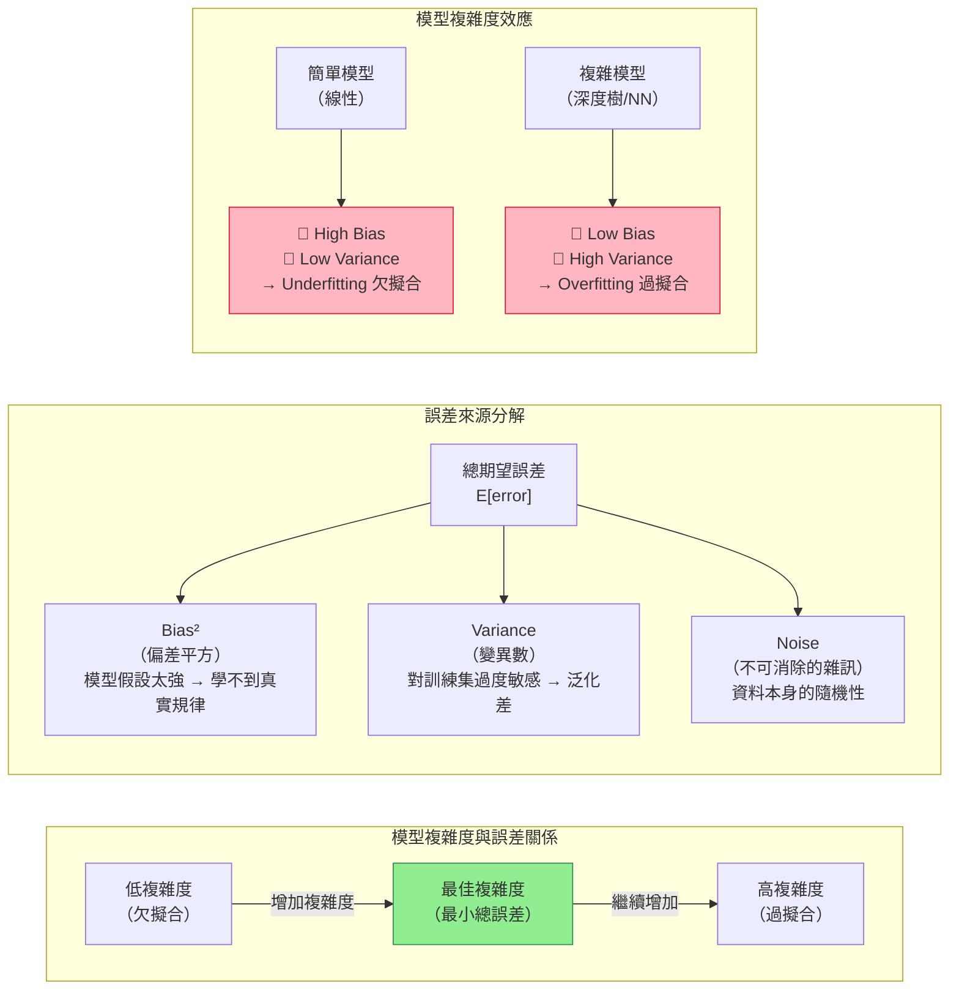

# 偏差-變異數權衡曲線（Bias-Variance Tradeoff Curve）



## 曲線示意（ASCII）

```
誤差
│
│\              ← Total Error（U 形）
│ \      ___/
│  \___/
│   ↑
│  最佳複雜度
│
│‾‾‾‾‾‾‾‾‾‾‾‾‾‾‾‾‾‾‾‾‾‾‾ Bias²（隨複雜度↑而↓）
│________________________ Noise（常數，不可消除）
│               _________ Variance（隨複雜度↑而↑）
└─────────────────────────→ 模型複雜度
  欠擬合 ←──── 最佳 ────→ 過擬合
```

## 考試快判

| 情境 | 診斷 | 解法 |
|---|---|---|
| 訓練準確率高，測試準確率低 | High Variance（過擬合） | 正則化、更多資料、降低複雜度 |
| 訓練準確率低，測試準確率也低 | High Bias（欠擬合） | 增加複雜度、更多特徵、減少正則化 |
| 兩者都高 | 最佳狀態 | — |
| 兩者都低 | 嚴重 High Bias | 重新設計特徵或模型 |

## 核心公式

$$E[\text{error}] = \text{Bias}^2 + \text{Variance} + \text{Noise}$$

- **Bias²**：模型的系統性錯誤（假設不夠彈性）
- **Variance**：模型對訓練資料的敏感程度（過度擬合訓練集）
- **Noise**：資料本身的隨機性（無法消除）
