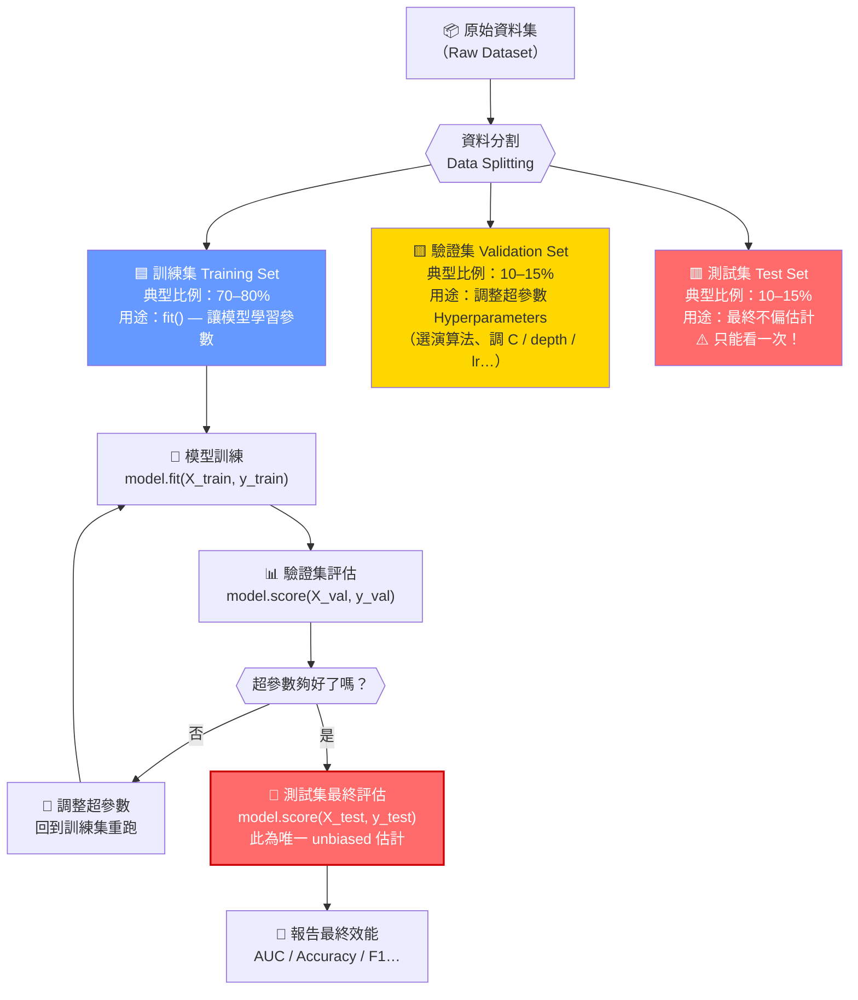

# 訓練/驗證/測試資料分割流程（Train / Val / Test Split Pipeline）



## 各資料集角色對比

```
┌─────────────────────────────────────────────────────────────┐
│                     原始資料集（100%）                        │
├──────────────────────┬────────────┬────────────────────────-┤
│   訓練集 Train 70%   │  驗證集    │    測試集 Test 15%      │
│                      │  Val 15%   │                         │
│ • model.fit()        │ • 調超參數 │ • 最終報告用            │
│ • 模型學習參數       │ • 選模型   │ • 絕對不能用來調參      │
│ • 可以多次使用       │ • 可多次比 │ • 只看一次              │
└──────────────────────┴────────────┴─────────────────────────┘
```

## ⚠️ 資料洩漏（Data Leakage）警告

```
❌ 錯誤做法：
訓練 → 用測試集調參 → 測試集評估
（測試集「見過」超參數選擇過程 → 樂觀估計，部署後效能下降）

✅ 正確做法：
訓練 → 用驗證集調參 → 最後只看一次測試集
（測試集對模型選擇過程完全盲）
```

## 常見比例

| 資料量 | 訓練集 | 驗證集 | 測試集 | 備註 |
|---|---|---|---|---|
| 中等（1K–10K） | 70% | 15% | 15% | 標準切法 |
| 較大（>10K） | 80% | 10% | 10% | 訓練集更多 |
| 很小（<500） | — | — | — | 改用 k-fold CV |
