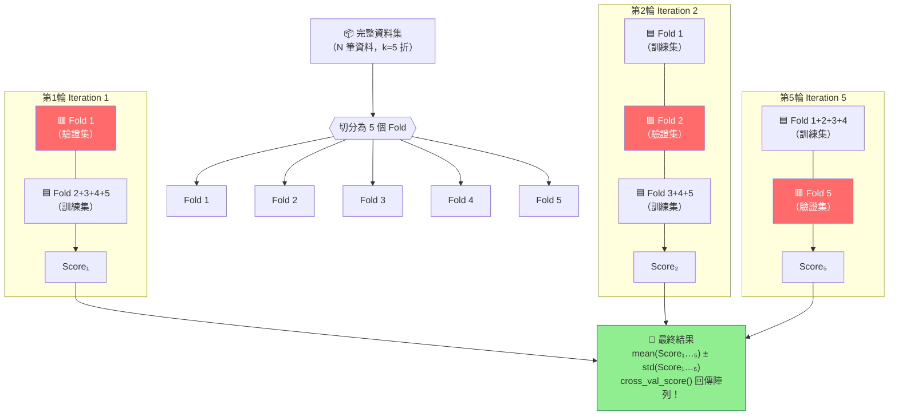

# K 折交叉驗證輪轉圖（K-Fold Cross-Validation Rotation）



## ASCII 輪轉示意圖

```
資料集切分（k=5）：
┌──────┬──────┬──────┬──────┬──────┐
│  F1  │  F2  │  F3  │  F4  │  F5  │
└──────┴──────┴──────┴──────┴──────┘

第1輪：[VAL ] [TRNG] [TRNG] [TRNG] [TRNG] → Score₁
第2輪：[TRNG] [VAL ] [TRNG] [TRNG] [TRNG] → Score₂
第3輪：[TRNG] [TRNG] [VAL ] [TRNG] [TRNG] → Score₃
第4輪：[TRNG] [TRNG] [TRNG] [VAL ] [TRNG] → Score₄
第5輪：[TRNG] [TRNG] [TRNG] [TRNG] [VAL ] → Score₅
                                              ↓
                                    mean ± std（陣列）
```

## cross_val_score 程式碼對照

```python
from sklearn.model_selection import cross_val_score, KFold
from sklearn.linear_model import LogisticRegression

model = LogisticRegression()
kf = KFold(n_splits=5, shuffle=True, random_state=42)

# ⚠️ 回傳值是陣列（array），不是單一數字！
scores = cross_val_score(model, X, y, cv=kf, scoring='accuracy')
# scores = array([0.82, 0.85, 0.79, 0.83, 0.81])

print(f"平均準確率: {scores.mean():.3f} ± {scores.std():.3f}")
# → 平均準確率: 0.820 ± 0.019
```

## K 值選擇指南

| 資料量 | 建議 k | 原因 |
|---|---|---|
| 一般（1K–10K） | k = 5 或 10 | 平衡計算量與估計穩定性 |
| 小資料集（< 200） | k = 10 或 LOO | 確保每折訓練集夠大 |
| 極小（< 50） | LOO (k=n) | 最大化每折訓練資料量 |
| 類別不平衡 | StratifiedKFold | 每折保持類別比例 |

## 考試重點

- `cross_val_score()` **回傳陣列**，不是平均值 ← 高頻 trap
- k 越大 → 計算越慢，但估計越穩定
- Stratified = 每折維持類別比例（解決不平衡問題）
