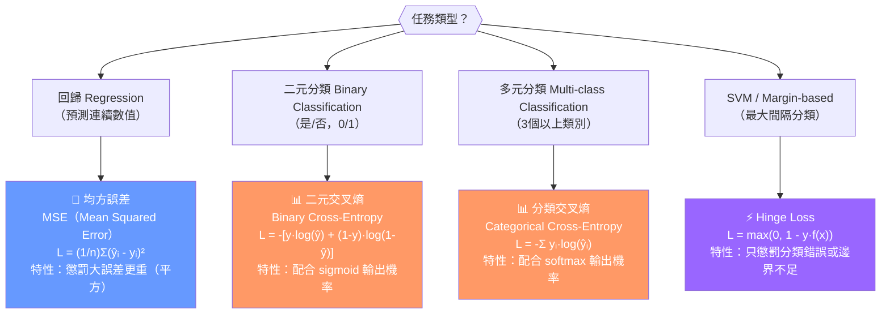

# 損失函數比較圖（Loss Function Comparison）



## 損失函數特性比較表

```
                    損失函數比較
┌─────────────────┬──────────────────────┬─────────────────┐
│                 │      MSE             │  Cross-Entropy  │
├─────────────────┼──────────────────────┼─────────────────┤
│ 任務            │ 回歸（連續輸出）     │ 分類（機率輸出）│
│ 輸出層搭配      │ Linear / 無          │ Sigmoid/Softmax │
│ 誤差放大        │ 大誤差懲罰更重       │ 高信心錯誤懲更重│
│ 梯度行為        │ 誤差越大梯度越大     │ 機率越確定梯度  │
│                 │                      │ 越清晰          │
│ 常見使用        │ 房價預測、溫度預測   │ 垃圾郵件、影像  │
│                 │                      │ 分類、NLP       │
└─────────────────┴──────────────────────┴─────────────────┘
```

## 各損失函數直觀說明

```
MSE 直觀（回歸）：
預測值 = 320萬，實際 = 300萬 → Loss = (320-300)² = 400
預測值 = 350萬，實際 = 300萬 → Loss = (350-300)² = 2500
↑ 誤差翻倍，損失變 6.25 倍（平方效應）

Cross-Entropy 直觀（分類）：
預測「是垃圾郵件」機率 = 0.9，實際是 → Loss = -log(0.9) ≈ 0.10（小）
預測「是垃圾郵件」機率 = 0.1，實際是 → Loss = -log(0.1) ≈ 2.30（大！）
↑ 高信心犯錯，懲罰非常重

Hinge Loss 直觀（SVM）：
正確分類且超過 margin → Loss = 0（不管）
分類錯誤或 margin 不足 → Loss > 0（懲罰）
```

## 選擇損失函數的口訣

```
看輸出類型決定損失函數：
• 輸出連續數值（房價、溫度）→ MSE
• 輸出 0/1 機率（sigmoid）→ Binary Cross-Entropy
• 輸出多類別機率（softmax）→ Categorical Cross-Entropy
• SVM 最大間隔 → Hinge Loss
```

## 考試快判

| 看到這個情境 | 選這個損失函數 |
|---|---|
| 回歸任務 / 連續值預測 | MSE |
| 二元分類 + sigmoid | Binary Cross-Entropy |
| 多類別分類 + softmax | Categorical Cross-Entropy |
| SVM / 最大間隔分類器 | Hinge Loss |
| 對大誤差特別敏感 / 懲罰異常值 | MSE（平方效應） |
