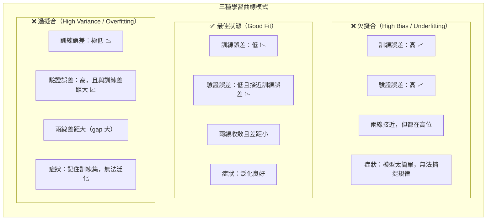

# 過擬合診斷學習曲線（Overfitting Diagnosis via Learning Curves）



## ASCII 學習曲線圖

```
誤差（Error）
  │
高│▓▓▓▓▓▓▓▓▓▓▓▓▓▓▓▓▓▓▓▓▓▓   ← 欠擬合：兩線都高且接近
  │▓▓▓▓▓▓▓▓▓▓▓▓▓▓▓▓▓▓▓▓▓▓
  │
  │
  │         ╔══════════════  ← 過擬合：驗證誤差遠高於訓練
  │         ║  驗證集誤差
  │         ║
  │─────────╚────────────── ← 過擬合：訓練誤差極低
  │  訓練集誤差
低│
  └──────────────────────── 訓練資料量 / 訓練週期 →

欠擬合診斷圖：
  高│▓▓▓▓▓▓▓▓▓▓
    │▓▓▓▓▓▓▓▓▓▓  ← 兩條線都在高誤差區，且幾乎重疊
  低└──────────

最佳狀態診斷圖：
  高│
    │╲
    │ ╲╲  ← 兩條線都往低誤差收斂，差距小
    │  ╲╲╲___
  低└──────────
```

## 診斷表

| 症狀 | 訓練誤差 | 驗證誤差 | 診斷 | 解法 |
|---|---|---|---|---|
| 兩誤差都高，差距小 | 高 | 高 | **High Bias（欠擬合）** | 增加模型複雜度、更多特徵、減少正則化 |
| 訓練低、驗證高，差距大 | 低 | 高 | **High Variance（過擬合）** | 更多訓練資料、正則化（L1/L2/Dropout）、降低複雜度 |
| 兩誤差都低，差距小 | 低 | 低 | **Good Fit（最佳）** | 不需要調整 |
| 訓練誤差在特定點開始升高 | 先低後升 | 持續高 | **訓練資料品質問題** | 清理資料、重新特徵工程 |

## 解法對應矩陣

```
┌─────────────────────────────────────────────┐
│              解法決策矩陣                    │
├──────────────┬──────────────────────────────┤
│ High Bias    │ ✅ 更複雜的模型              │
│ （欠擬合）   │ ✅ 加更多特徵               │
│              │ ✅ 減少正則化強度           │
│              │ ❌ 加更多訓練資料（幫助小） │
├──────────────┼──────────────────────────────┤
│ High Variance│ ✅ 加更多訓練資料           │
│ （過擬合）   │ ✅ 加正則化（L1/L2）       │
│              │ ✅ Dropout（神經網路）      │
│              │ ✅ 降低模型複雜度           │
│              │ ❌ 加更多特徵（通常更差）   │
└──────────────┴──────────────────────────────┘
```

## 考試快判

- 「訓練準確率 95%，測試準確率 62%」→ **過擬合（High Variance）**
- 「訓練準確率 65%，測試準確率 63%」→ **欠擬合（High Bias）**
- 「加正則化後驗證誤差下降」→ **解決過擬合**
- 「加更多訓練資料但驗證誤差仍高」→ **High Bias 問題（資料量不是解法）**
