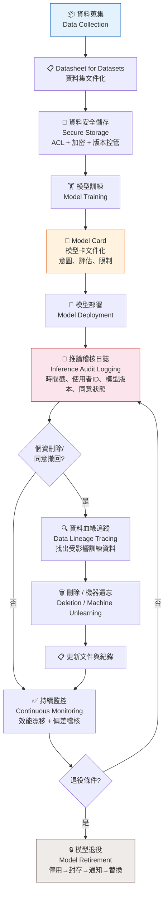

# ML Lifecycle Compliance Flow
# L23401 數據隱私、安全與合規

## 圖說

**ML lifecycle 合規鏈** 說明從資料蒐集到模型退役的完整治理流程。

| 階段 | L23401 治理動作 | 考試關鍵字 |
|------|----------------|-----------|
| 蒐集前 | Datasheet 文件化 | 資料來源、同意基礎 |
| 訓練後 | Model Card 文件化 | 意圖用途、評估結果、限制 |
| 部署中 | Inference Audit Log | 推論紀錄、稽核 |
| 刪除請求 | Data Lineage 追蹤 | 資料血緣、影響範圍 |
| 退役時 | 停用+封存+通知 | 模型退役程序 |

> 考試快判：題目描述「某公司部署模型後需要追蹤每次決策」→ Inference Audit Logging
> 題目描述「個資主體要求刪除，公司需找出哪些訓練資料受影響」→ Data Lineage Tracing
