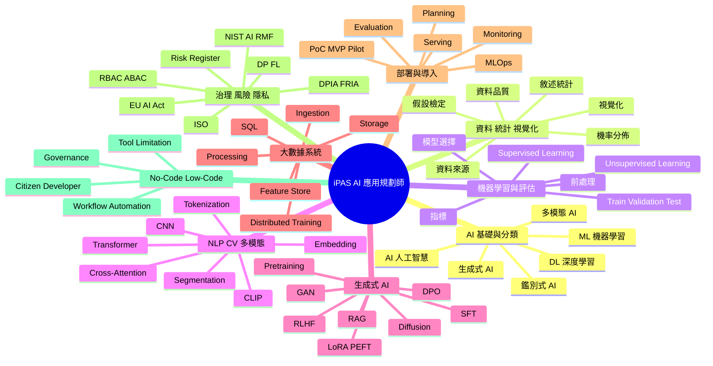
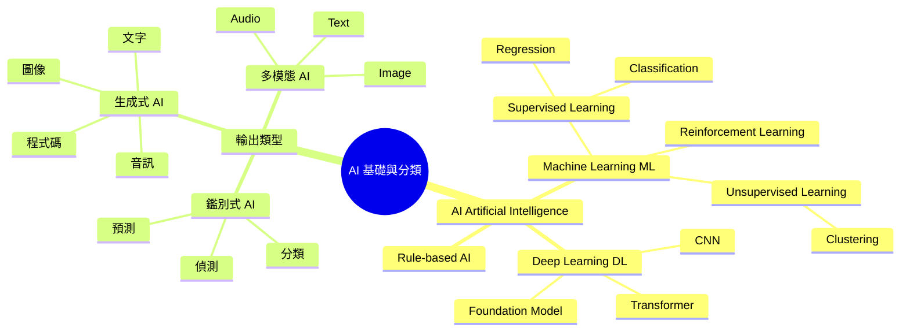
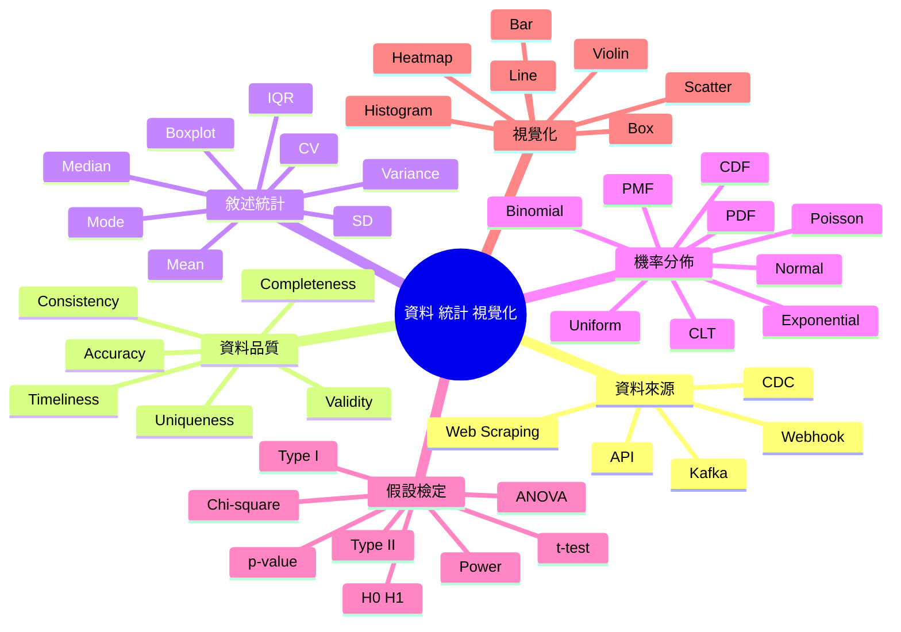
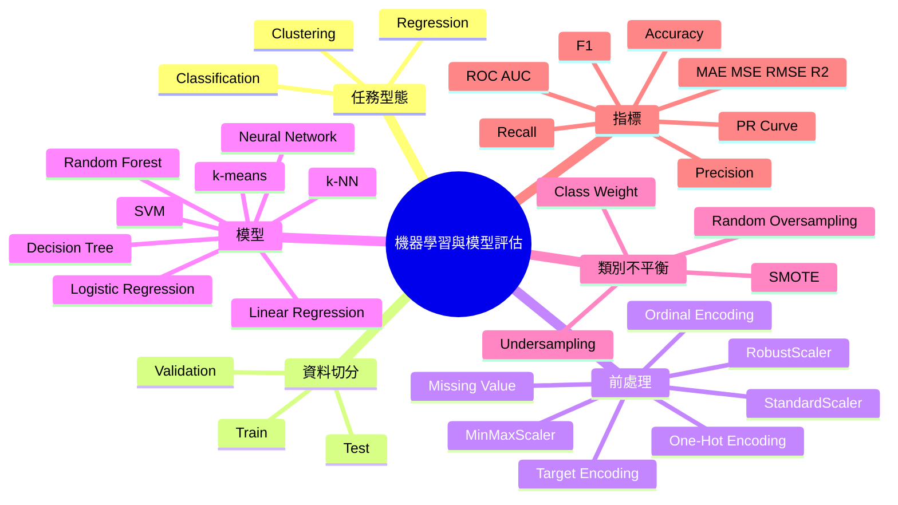
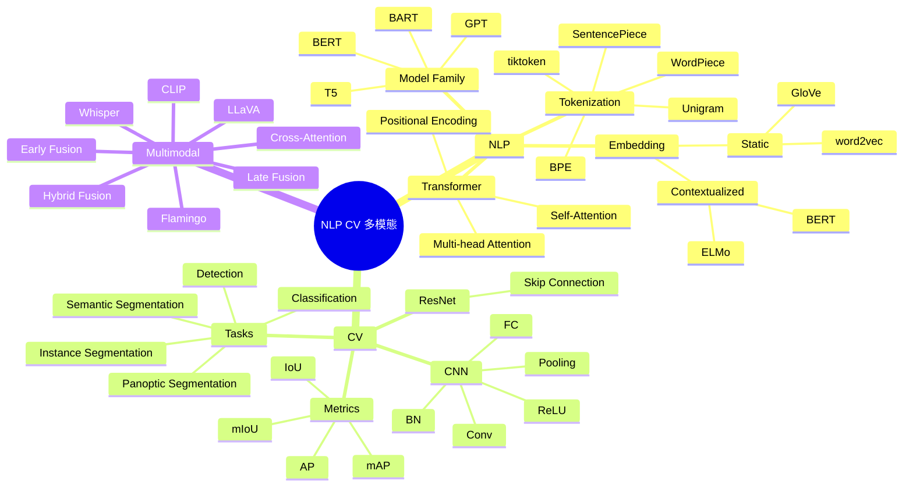
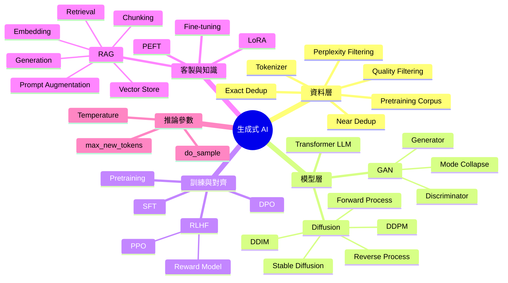
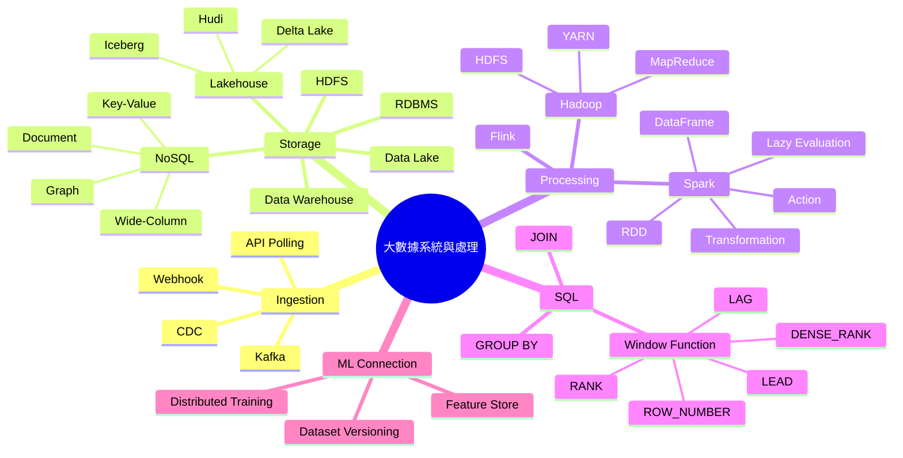
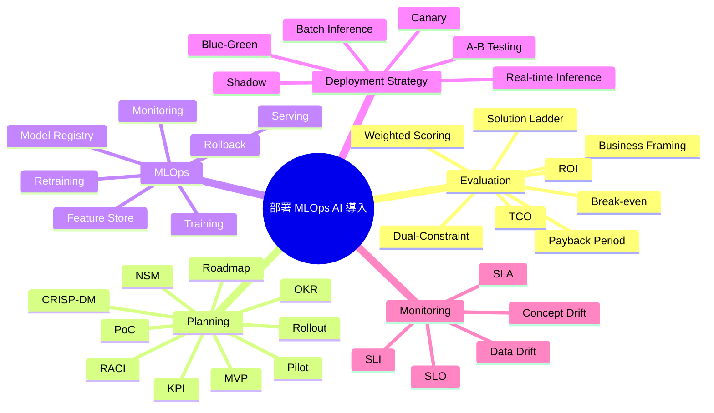
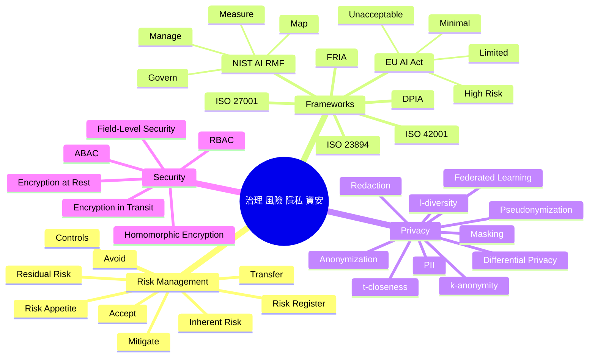
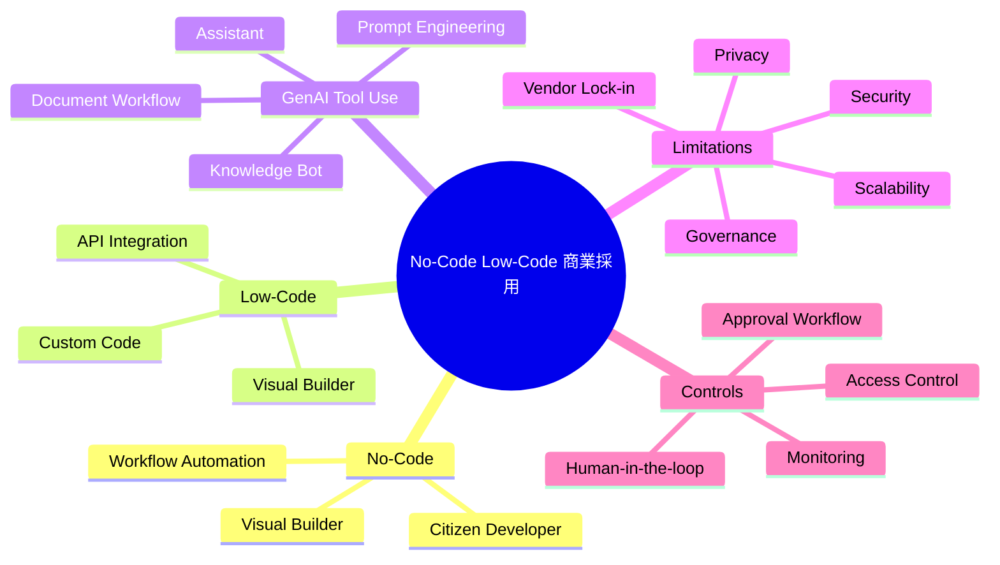

# iPAS AI 應用規劃師 Mindmap

> 這份檔案使用 Mermaid `mindmap` 語法。用途是快速看「層級結構」：每個名詞大概屬於哪一區、上下游是什麼。

---

## Overview Mindmap

---

## Area 1 Mindmap：AI 基礎與分類

## Area 2 Mindmap：資料、統計與視覺化

## Area 3 Mindmap：機器學習與模型評估

## Area 4 Mindmap：NLP、CV、多模態

## Area 5 Mindmap：生成式 AI

## Area 6 Mindmap：大數據系統與處理

## Area 7 Mindmap：部署、MLOps 與 AI 導入

## Area 8 Mindmap：治理、風險、隱私與資安

## Area 9 Mindmap：No-Code / Low-Code 與商業採用

